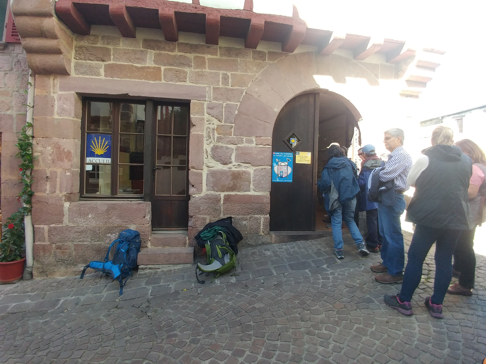
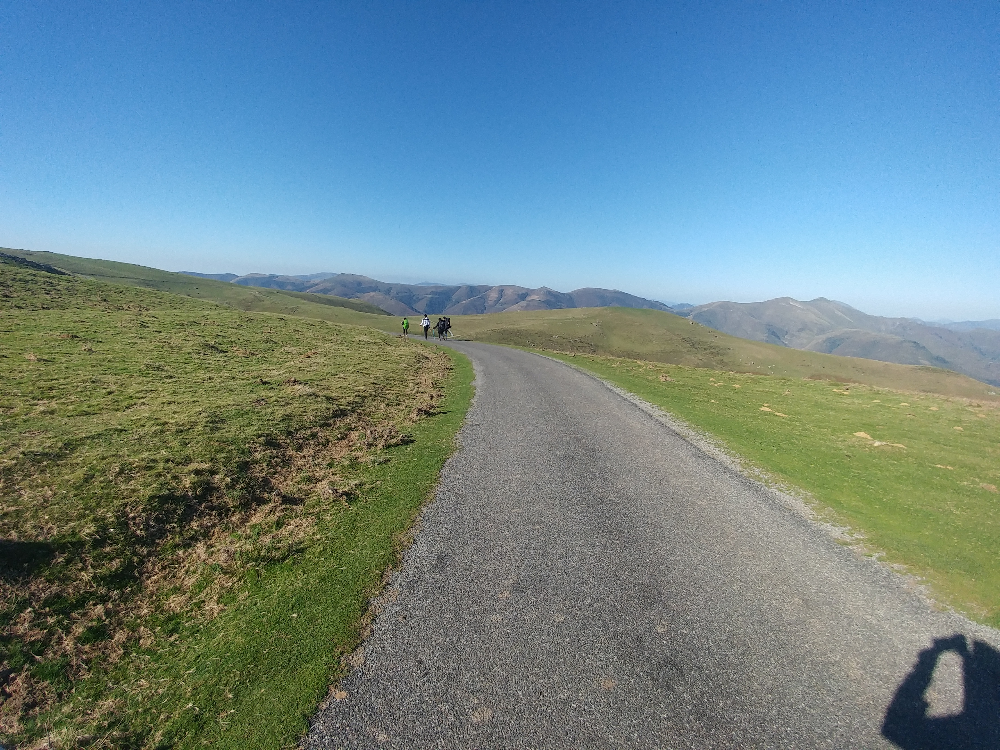
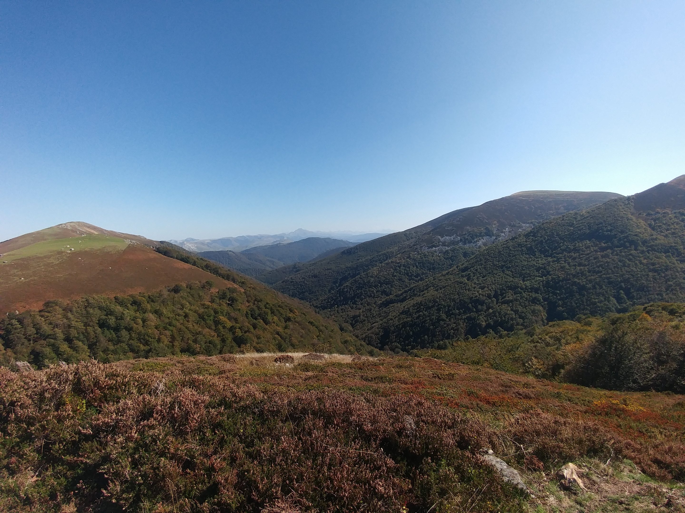
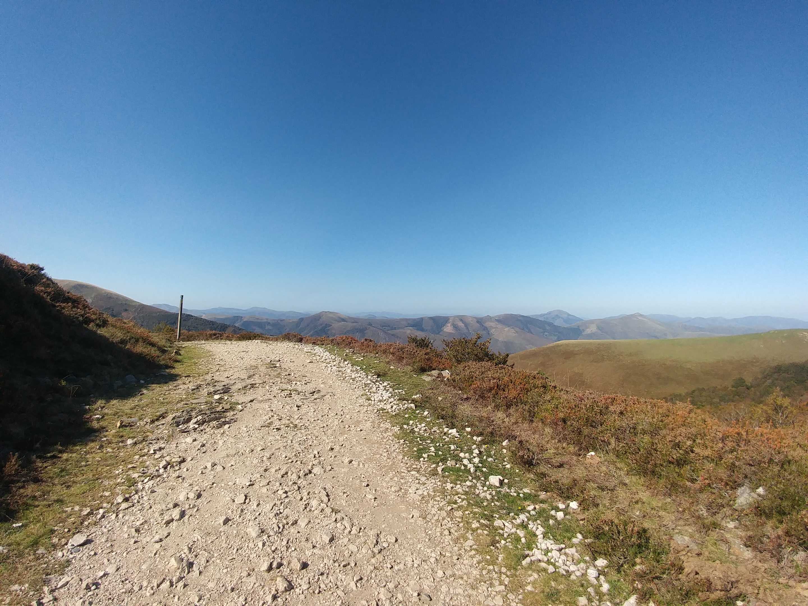

### 02 _1일째\_ 예측 불가능한 피레네  

  
프랑스 길 첫날에 대한 이야기는 워낙 유명하다. 
산티아고 길을 걸으려고 알아보는 사람들은 
생 장(Saint-Jean-Pied-de-Port:생 장 삐에 데 뽀흐)에서 
론세스바예스(Roncesvalles)로 향하는 피레네 산맥을 넘는 이야기부터 접하게 되곤 한다.

바로 나폴레옹이 넘었다는 나폴레옹 루트에 대한 이야기다. 
열 시간을 넘게 걸었다는 이야기부터 산 위의 바람이 엄청 세차게 불어닥쳐 몸이 
밀린다거나 정상 부근의 날씨는 예측할 수 없다는 이야기, 
애당초 산 위에 날씨가 좋은 날은 손에 꼽힌다는 이야기까지. 
비교적 초반 1/3 지점 쯤에 있는 오리손 산장을 지나면 
그 이후에는 음식과 물을 보충할 곳도 잘 곳도 없으므로 
무슨 수를 써서라도 론세스바예스까지는 가야 한다는 등의 이야기다.  

열 시간이 넘는다는 첫날의 거리는 총 25.7km 가량이다. 
평지로 간다면 열시간이 넘지 않겠지만 
낮은 지대인 해발 165m 인 생 장에서 출발하여 고도가 1430m 가 넘는 피레네를 
넘어야 하는 경로다. 평소 대비 1.5배 이상의 시간이 걸리고 
높은 고도의 산을 처음부터 끝까지 통과하는 코스인 만큼 
별 다섯개짜리 난이도의 일정이라고 할 수 있다.  
그에 더해 한국에서 출발한 경우에는
시차에 적응되지 않은 상태이기때문에 가장 힘든 일정이 바로 첫 날인 것이다.

파리 몽파르나스에서 TGV 를 타고 출발하여 바욘에 도착한 뒤 일반 열차로 갈아탔다.
바욘에서 다시 생 장까지 열차로 이동하여 새벽부터 오후에 드디어 생 장에 도착했다.

순례자 사무소에서 나도 순례자 등록을 마친 뒤 피레네를 대비했다.   

순례자 사무소 앞의 골목길을 따라 내려가면
다음 마을로 짐을 보내주는 서비스를 하고 있는 동키 사무실이 있다.
아무래도 첫 날은 배낭을 메고는 피레네를 넘을 수 없을 것 같아 론세스바예스로 부치기로 했다.
동키 사무실에 큰 배낭을 맡기고 작은 가방에 필수 짐만을 챙겨 숙소로 갔다.

다음 날 새벽 다섯시 반부터 일어나 간단히 씻고 발등, 종아리, 무릎 등 
다리에 키네시올로지 테이핑을 하며 할 수 있는 최대한 준비했다. 
발등과 무릎 장경인대 통증이 걱정되었다. 
또 첫날 물집이 잡힌다는 경험담을 많이 보았던지라 
각각의 발가락도 종이테이프로 감았다. 
그리고 그 위에 또 다시 바셀린을 발라 물집을 대비 했다.

준비 하는데만 한 시간이 넘게 걸렸고 당연히 아침을 먹을 시간은 없었다. 
500ml 물통 세 병에 물을 채웠다. 
전날 사둔 빵, 과일을 작은 가방에 챙기고 생 장으로 오던 기차에서 알게 된 
동현씨와 알베르게에서 알게된 미국인 새라도 함께 출발했다.

생 장을 빠져나가면서부터는 계속해서 올라가는 길이었다. 
아직 어두울 때 헤드 랜턴의 불빛에만 의지하여 하늘에 보이는 별자리를 지도 삼아 나아갔다.
계속되는 오르막이 어찌나 힘들던지 그 간의 많은 여행으로 스스로 잘 걷는다고 생각했던 것이 
전혀 그렇지 않았구나 싶었다.  
나보다 나이가 많아 보이는 외국인들이 훨씬 잘 걸었다. 
내 뒤에서 나타난 그들은 'Bonjure~'(봉쥬~흐) 인사를 건네곤 앞으로 빠르게 사라져갔다. 
그들의 다리가 더 튼튼했다.

한 시간 가량 걸으니 동이 트며 산티아고 길에서 첫 일출을 맞고 있었다. 
저 아래로 아직 아침 안개에 쌓인 고요한 생 장이 보였다. 
위를 쳐다보니 이제야 피레네의 시작이었다. 여전히 갈 길은 멀었다.

두 시간 반쯤 걸어 완전히 밝아졌을 때 오리손 산장에 도착했다. 
이 곳을 지나면 이제 더 이상 쉴 곳이 없어서 무조건 론세스바예스까지 가야 한다던 곳이었다. 
오리손까지만 해도 가파른 오르막이 많았다. 
이 정도의 두 시간 반 연속 산행조차 한국에서 해 본지 너무 오래전이었다. 
이미 몸의 여기 저기가 힘들다고 아우성치기 시작했다.

오리손 산장의 고도는 해발 650m 정도이다.
생 장이 해발 165m 이기 때문에 꽤 높은 산을 오른 셈이랄 수 있는데
서울의 관악산이 해발 630m 정도이니 높이로만 따져보면
그 정도에 비교할 수 있을 터이다.
이를테면 관악산의 정상까지 등산했는데도 정상까지 가려면 
온 만큼의 이상이 더 남았다고 생각해보면 대략의 비교가 될 것이다. 

피레네를 넘을 때는 물을 500ml 한 병만 준비하면 안된다고 했다. 
열 시간이 넘게 걸리는 길이니만큼 산속에서 물이 다 떨어지면 
탈수로 위험하다. 때문에 최소 물 1L는 준비해야 한다는 말도 부담되었다.
그래서 500ml 물병 3개를 준비했고 이는 곧 무게 1.5kg이 추가됨을 의미했다.

작은 슬링백만을 지고 있었기에 배낭이 무거운 것은 아니었지만 첫날이라는 무게가 무거웠다.
또 산을 넘는 동안 먹을 빵과 과일 또한 어깨를 무겁게 했다.

간간히 물만 마시며 올라오다가 오리손에서야 가방을 내리고 잠시 쉬며 아침을 먹었다.
아침식사를 하며 앞으로 가야 하는 거리를 가늠해보는데
총 열 시간이 넘는 거리라는 중압감이 온 몸을 짓눌렀다.
이제 두 시간 반을 걸었으니 앞으로도 일곱 시간은 더 넘게 남았다는 의미였다.
뒤로 갈수록 점점 더 힘들어질 것은 자명했다.

오리손 산장을 출발하며 그 동안 마셔서 비워진 물병 세 개를 다시 채웠다.  
화장실을 다녀온 후 오리손을 출발해 본격적인 피레네속으로 들어가기 시작했다. 

피레네 속으로 들어서자 말로만 듣던 강풍이 끝없이 몰아쳤다. 
정말로 몸이 바람에 밀리고 걷기가 어려웠다. 
산을 오르는 것 만으로도 힘든데 바람에 맞서서 버티며 앞으로 나아가려니 
온 몸에 힘이 들어가고 모든 곳이 아파오기 시작했다.

한편으로는 계속 부는 바람이 산에 오르느라 몸에서 나는 열기를 식혀주니 
시원하다고도 느꼈다.

깊숙한 피레네로 들어가는 동안 
고도 역시 점차 높아져갔다. 바람이 계속 불어치니 조금씩 추워지기 시작했다.
하지만 산행으로 몸에서 열기도 계속 오르고 있었다. 
오르는 열기를 바람이 식혀주는 것으로 여기면 
작은 배낭에 말아 넣어온 경량 패딩은 안입고도 버틸 수 있을 것 같았다.
산 정상의 추위에 대비해 다음 마을로 보내는 짐에 넣지 않고 가져온 것이다.

그렇게 바람을 견디고 견뎠는데 몸이 너무나 식어버렸는지 덜덜 떨리기 시작했다. 
어느 순간부터는 추위를 견딜 수 없을 지경이었다. 
체온이 너무나 떨어지기 시작 하는게 느껴졌다.
너무 추워 어쩔 수 없이 배낭에서 패딩을 꺼내 입었다. 
그런데 참다 참다 추워서 꺼내 입은 패딩이 무색하게 얼마 안가 바람이 잦아들었다.

패딩을 입어서 따뜻한 것이 아니라 바람 자체가 불지 않았다.
그러나 조금 겪어본 바 피레네에서 바람이 불지 않을리가 없잖은가 싶었다.
'앞으로도 남은 길은 길고 산은 깊으니 곧 바람이 다시 불겠지..?' 라는 생각으로 
패딩을 벗지 않고 계속 걸었다.
그런데 한참이나 바람이 불지 않는 것이다. 

바람이 불지 않으니 점점 더워지면서 이번에는 더위를 도무지 견딜 수 없었다.
분명 바람이 불 때는 몸이 덜덜 떨릴 정도로 추웠는데 
이제는 찜통같이 더워서 온 몸과 옷이 땀에 절여지고 있었다.
덧입은 패딩마저 땀에 젖어 축축해지는 것이 느껴질 정도였다.

그늘 한 점도 없는 능선을 따라 바람조차 한 점 없이 산을 오르니 몸의 열기와 
정오의 햇볕이 너무나 뜨거웠다.
이에 더해 땀에 절은 옷이 무겁게 느껴지기 시작하니 견디기가 더더욱 힘들었다.
도저히 안되겠다는 생각이 들어 드디어 배낭을 내리고 패딩을 벗어 말아 넣었다. 

그렇게 더위를 못견뎌 패딩을 벗어 배낭에 넣은지 불과 얼마 되지 않았는데 
약올리듯 몸이 밀리는 세찬 바람이 또다시 불어 닥치기 시작했다.
이럴 줄 알았으면 벗지 말고 조금만 더 버틸 걸 싶었다.
바람이 내가 옷을 입고 벗는 것을 지켜보다가 농락하는 것 같았다.

패딩을 벗은 채 땀에 절여진 몸에 강풍이 몰아치니 또 다시 빠르게 체온이 식어갔다.
하지만 배낭에 패딩을 넣은 지 얼마 되지 않았기도 하거니와 
또 바람이 금방 그칠지도 모른다는 생각에 바람을 그냥 버티기로 했다.

그러나 정상에 다가갈수록 거세어 지는 바람에 도무지 버텨낼 재간이 없었다.
또 다시 이가 딱딱 부딪치고 몸이 덜덜 떨리는 정도가 되어서야 배낭에 말아 넣었던 경량 패딩을 꺼내 입었다.

---

새벽에 길을 나설 때 추울 것 같아 이 패딩을 입었다. 
그렇게 오리손까지 이르는 오르막에서 패딩이 너무 더워 찜통 같기에 못견디고 벗었다. 
그 때 작은 슬링백에 말아 넣었던 것이다.
그렇게 배낭에 넣을 때만 해도 론세스바예스까지 보낼 것을 짐만 되게 괜히 들고 왔다 싶었다. 
그런데 이번엔 입고 와서 다행이라는 생각이 들었다.

산을 계속 오르는 동안 이렇게 번갈아 찾아오는 바람과 추위에 덜덜 떨다가 겨우 패딩을 꺼내 입었다가
반대로 더위에는 안벗고 땀을 뻘뻘 흘릴 정도가 되어서야 
약올림 당하는 느낌으로 뒤늦게 패딩을 벗는 것을 반복하고 있었다.

너무 이상했다. 항상 너무 추워서 더 이상 못 버티겠다 싶어 입으면 머잖아 바람이 그쳤다.
바람이 그쳤어도 곧 다시 불 것 같아서 안 벗고 있으면 
바람이 없는 시간이 길어지며 더위를 견딜 수가 없었다. 
피레니의 그 바람이 왜 이렇게 안 부는 것인가.

그러다가 어느 순간, 버티고 버티다 뒤늦게야 입고 벗는 걸 그만하자는 생각이 들었다.  

> '추워지면 바로 입자. 더워지면 바로 벗자.' 

     
피레네의 바람과 날씨는 
나의 예측을 허락하지 않는다는 것만이 내가 알 수 있는 전부였다.

옷이나 모자를 그때 그때 빨리 입거나 벗지 않고 버텼던 이유는
이미 몸의 여기 저기가 아프다고 아우성 이었기때문이었다.
패딩을 입고 벗을때마다 작다곤 하지만 슬링백을 내렸다 메었다, 
말아 넣었다 빼냈다하는 그 반복이라도 조금 덜 하고 싶은 심정이었던 것이다.
조금이라도 덜 괴롭고 싶어서 한 선택이었는데 결국은 의미가 없었다.

> '지금 춥지만 입었다가 바람이 곧 그치면 또 벗어야 할테니 그냥 입지 말고 버텨보자.'

라고 버티면 바람이 그치질 않아 한참이나 추위에 떨다가 견딜 수가 없는 지경이 되어서야 겨우 입었다.  

> '이제는 산 깊은 곳으로 점점 올라가잖아. 곧 다시 바람이 불어 추워질거야. 
> 더워도 조금만 더 입고 버텨보자.'

라는 생각에 안 벗고 버티면 산 정상 부근임에도 바람이 없는 구간이 길어지곤 했다.

그렇게 더워도 버티다가 또 다시 땀에 절여져 도저히 못견뎌 벗으면 그제야 바람이 불었다.
그러면 또 다시 땀이 바람에 식어 온 몸이 덜덜 떨려왔다.
입고 조금만 더 버텼으면 됐을 텐데 싶어도 그 바람이 언제 불어 추워질 지, 언제까지 더울 지 
아무것도 알 수가 없었다.

어찌 이럴수가!
내 나름의 입고 버텨보자, 안 입고 버텨보자는 계획은 몇 시간이 채 안되는 사이 셀 수 없이 깨어지고 있었다.
도무지 중간이 없었다.   

인생에서 예측 가능한 것은 예측 할 수 없다는 것 뿐이라고 했던가.
피레네의 바람을 예측해보려는 시도는 의미가 없다는 것만 알 수 있었다. 
그냥 지금 바로 대처할 수 있는 것을 하는 편이 낫구나 싶었다.

그제서야 깊은 산속에서
이 높이까지 올라와서 풀을 뜯는 여기 저기의 양 무리와
산봉우리들만이 첩첩이 쌓인 피레네의 풍경이
저 멀리서부터 한 눈에 담겨왔다.

정말 맑은 하늘은 청명 그 자체였다.

첫 날 묵었던 알베르게의 주인이 새벽에 떠나는 나를 배웅 해주며 
오늘 날씨가 좋으니 내게 운이 좋다고 했다.
큰 비가 어제 내렸고 오늘은 날씨가 맑을 예정인데 
이런 피레네를 만나기가 쉽지 않다는 말과 함께 말이다.

어차피 이 피레네를 넘는 것은 열 시간이 넘게 걸리는 길이고 
그 동안 상황에 따라 옷을 입고 벗는 반복을 피할 수는 없다는 것을 깨달았다. 
비가 오지 않는 날씨인 것만해도 나는 운이 좋은 것이다.

생각이 이에 미쳐 이제 조금 추운데 싶어지면 귀찮아도 패딩을 바로 꺼내 입고 
조금 더운데 싶으면 바로 벗어들었다. 
주위를 둘러보니 피레네를 넘는 모든 순례자들이 
그렇게 입고 벗기를 반복하고 있었다.

어느 새 사람들의 인사는 'Bonjure~(봉쥬~ㅎ)' 에서 'Hola~(올라~)' 로 바뀌어 있었다.
피레네에서 국경을 넘은 것이다.

걷기 시작한 지 여섯 시간 즈음 됐을까 정상을 지나 하산이 시작되었다.
물론 하산이라고 해서 내리막만 있는 것은 아니다. 
하산 중이라해도 작은 오르막과 내리막은 반복되었다.

바람 또한 여전했다. 
알베르게 주인의 말대로 비바람이 아닌 것만해도 얼마나 다행인지 몰랐다. 
비가 오지는 않아도 해가 들지 않는 산비탈 뒤는 전날 내린 비로 진흙탕길이 이어지기도 했다.
진흙구덩이에 등산화가 푹푹 박혔다. 
찐득한 진흙을 밟은 신발을 빼다가 자칫 균형이라도 잃었다간 
이 진흙탕에 나뒹굴 것 같았다. 상상만 해도 아찔했다.

내리막에서 무릎이나 발등에 더 큰 무게가 실린다는 것을 알고 있었는데 
특히 내가 염려했던 것은 장경인대 염의 재발이었다. 
장경인대 염증은 무릎 바깥 쪽에 찢어지는 듯한 통증을 동반하고 
특히 내리막을 걸을 수 없게 만드는 특징이 있다. 
그러니 재발은 곧 순례길의 중단을 의미했다.
그렇다보니 내리막에서는 스틱에 힘을 주어 더 조심히 걸었다. 
스틱에 힘을 더 주어 체중을 싣다 보니 팔부터 등 어깨에 
부하가 많이 걸렸고 상체까지 아프기 시작했다.

하산을 시작한 지 두 시간은 더 지났을까 싶었을 때 
저 아래에 도착할 마을이 보였다.
가까워 보이는 마을을 보며 이제 저 마을을 향해 가면 되겠구나 싶었다. 
그런데 아무리 내려가도 어쩐지 더 깊은 산으로 들어가는 것 같을 뿐.

고도가 낮아져가니 위에서 보이던 마을이 더 이상 눈에 보이지 않았다. 
내가 가는 길이 맞나 싶을 때 쯤마다 등장하는 산티아고 길 표지석의 거리가 조금씩 줄고 있었다. 
표지석의 숫자를 보며 오늘의 목적지에 가까워져 가고는 있을 것이라고 되뇌이며 걸을 뿐이었다. 

그렇게 열 시간 여를 넘게 걸으며

> '도대체 이 길이 언제 끝나지. 끝나긴 끝나나?'

싶은 생각으로 숲속에 난 오솔길을 따라 돌아서는데 
그림자도 보이지 않던 론세스바예스가 갑자기 
숲 한 가운데에서 웅장한 모습을 드러냈다.  

--- 

피레네를 넘은 순례자가 론세스바예스 알베르게를 처음 만났을 때 심정은 이 한마디로 표현할 수 있지 않을까?

> “아...! 살았다...!!”

피레네를 넘은 순례자 구호를 위해 생겼다는 마을 론세스바예스. 
그리고 그 곳에 있는 수도원에서 운영하는 론세스바예스 알베르게는 
150명을 넘게 수용할 수 있을 정도로 굉장히 큰 규모의 역사가 오래된 건물이었다. 

끝나지 않을 것 같던 숲 속에서 갑자기 모습을 드러내는 
론세스바예스 알베르게를 만났을 때 그 웅장한 규모에 놀랐고, 
살았다는 느낌에 안도했다.  

내가 피레네를 넘은 날은 이 계절에 날씨가 정말 좋은 일년에 손에 꼽히는 
몇 안되는 날이 맞았다. 나중에 들은 바 내가 넘은 바로 다음 날도 비가 엄청나게 내렸다고 했다.  
후에 만난 나보다 하루 늦게 출발한 순례자의 표현을 빌자면 
폭우 속에 3m 앞도 보이지 않았다고 했다. 
15시간 넘게 끝이 보이지 않는 산속에서 진흙탕을 헤메이다 
이렇게 첫 날 피레네에서 조난되어 죽는가라는 생각이 들 때
눈 앞에 웅장한 론세스바예스가 갑자기 나타났다고 했다.  

그 때,

> '아... 이제 살았구나.' 

외엔 아무런 생각도 들지 않았다고 말했다.

나는 6L 짜리 작은 슬링백만을 가지고 걸었는데도 고관절과 다리 그리고 어깨와 등에 심한 통증이 있었다. 
한 마디로 그냥 온 전신이 아팠다. 
그래도 다행스럽게도 꼼꼼히 했던 다리와 무릎의 테이핑덕에 
무릎과 발등 부상이 재발하진 않았다. 물집 방지를 위해 열 발가락에 둘렀던 
종이 반창고와 바셀린도 제 역할을 다 해서 물집없이 피레네를 마쳤다.

피레네를 넘는 동안에는 오로지 론세스바예스 알베르게 도착만을 고대했다.
알베르게에 도착하면 곧 바로 뻗어버릴 것 같았다.
그러나 짐을 풀고 나자 신기하게도 곧 웃고 떠들며 
각국에서 온 순례자들과 친해졌다.
피레네를 넘던 그 날의 순례자들 대부분 동지애가 생겨나
서로를 친근하게 느끼는 것은 비단 나 뿐이 아니었다.  
모두 아픈 다리를 끌고 절뚝거리며 레스토랑에 나가 
(어디에 그런 에너지가 남아 있었는지) 
왁자지껄하게 저녁식사를 같이 하면서 각자의 고통에 찬 피레네를 반추했다.

---

피레네를 넘는 동안 산 위의 변화무쌍한 상황에
조금 더 조금만 더 라는 생각으로 버텼다. 
이미 걷는 것만으로도 힘들었기에 다른 고통을 더하고 싶지 않기 때문이었다. 
그러나 모든 시도는 오히려 추워 견딜 수 없게, 
더워 견딜 수 없게 만들기만 할 뿐이었다.

높게 솟은 피레네는 그렇게 산등성이마다 품은 바람으로 
삶은 한 걸음 앞도 예측 불가능하다는 것을 무심히 알려주었다. 
그리고 이제는 론세스바예스에 도착한 내게 어쩐지 조금은 고요한 시선을 보내고 있었다.

어둠에 잠긴 피레네를 바라보며 생 장에 도착한 날 동키 사무실에 배낭을 맡기러 들어갔을 때, 봉사자와의 대화가 생각났다.
동키 사무실에 있던 봉사자는 배낭을 접수해주며 내게 어디서 왔는지 물었다.

> "Bonjure~ 어서와~ 어디서 왔니? 한국?"

> "응, 한국에서 왔어. 한나라고 해."

내가 대답했다.
순례길에 한국인이 워낙 많기에 으레 동양인이 보이면 한국인으로 여기는 것 같았다.

> "배낭은 론세스바예스까지 보낼거지? 그나저나 멀리서 왔네."

이 말을 들은 내가 다시 대답했다.

> "응, **집**에서 멀리 왔어. 많이 긴장되고 내일이 걱정스럽기도 해."  

집에서 멀리 와서 긴장된다는 내 말을 들은 봉자사는 코를 찡긋 하며 미소짓더니 
윙크를 하며 말했다.

> "이제부턴 **이 길이 너의 집**이야, 한나."  
> "From now, **'El Camino' is your home** Hanna." 

봉사자의 이 말을 듣는 순간, '아... 그렇구나.' 라는 생각이 들었다. 
그와 함께 집에서 멀리 와서 긴장되었던 마음이 한순간에 진정되었다. 
나는 집에서 멀리 떠나온 것이 아니라 이 **길**이라는 새로운 집에 도착한 것이었다.

길이 나의 집인 나날은 이렇게 시작되어 첫 번째 하루가 저물고 있었다.

저녁 식사를 마치고 알베르게로 돌아가 침대에 몸을 뉘이자 곧 잠에 빠져버렸다.
아직 적응되지 않았음이 분명할 시차, 여기저기 아픈 몸,
다음 날에 대한 여전한 걱정, 낯선 숙소, 많은 인원과 소음 따위는 무색하게도.