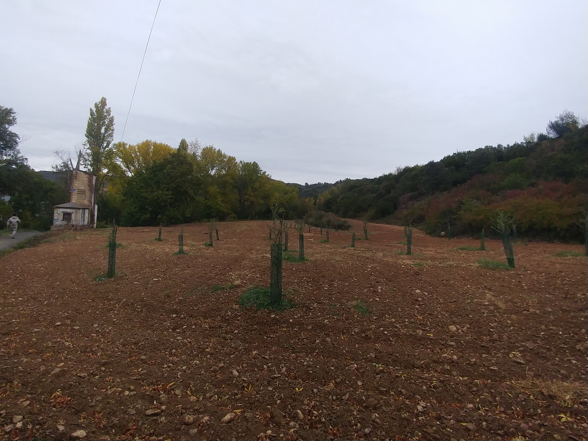
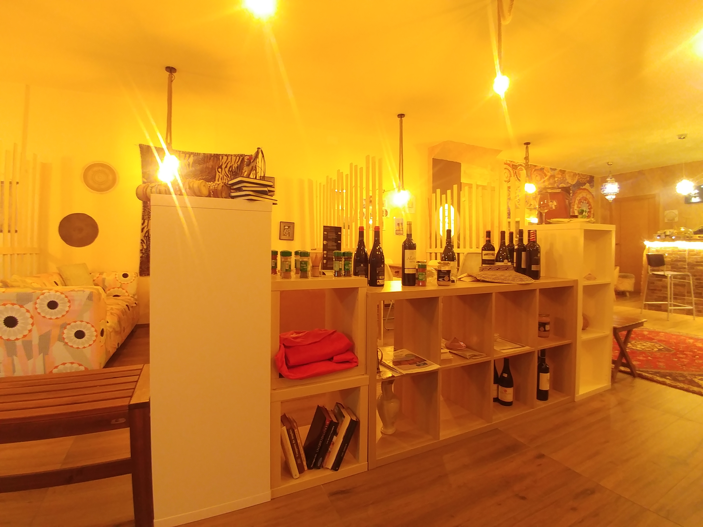
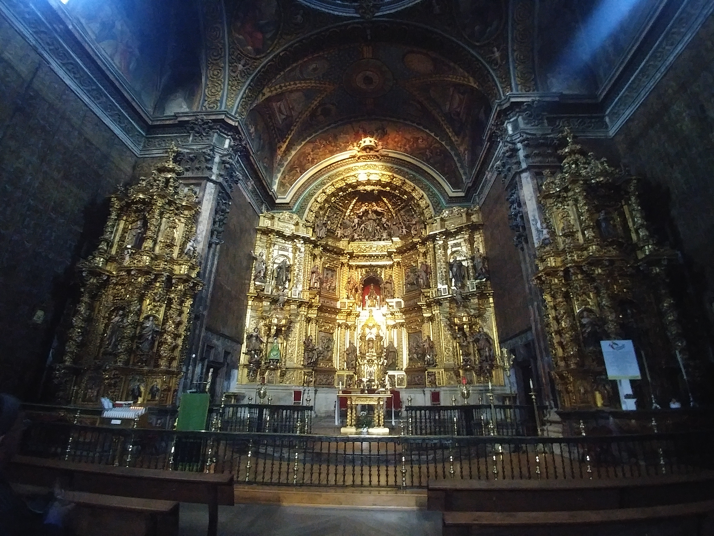
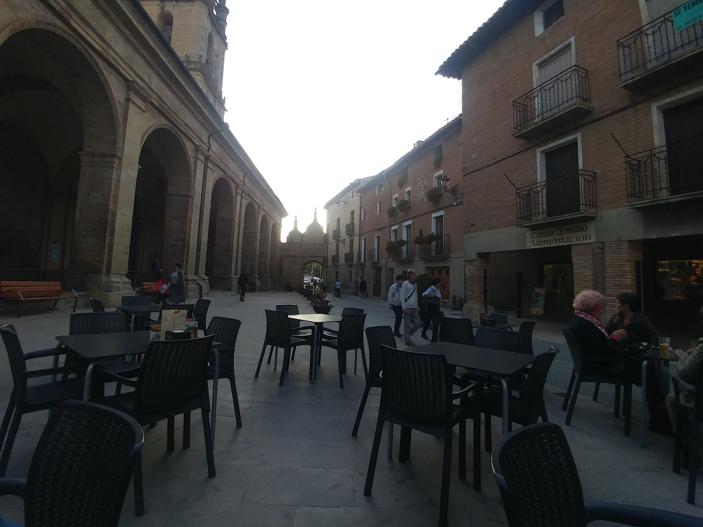
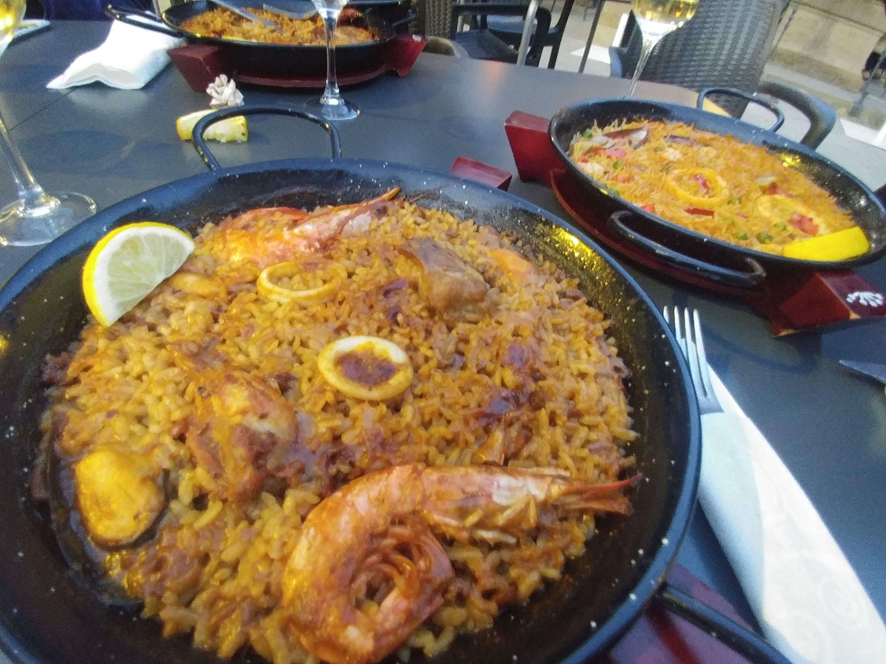

## 06 _8일째\_ 뼈 맞는 고통

빌라뚜에르따에 기진맥진 도착하여 들어간 까사 매지카에서는 
정말이지 푹 쉴 수 있었다.
까사 매지카에 도착했을 때만 하더라도 
내일 또 걸을 수 있을까 싶을 정도로 우리는 지쳐있었다.
그런데 피로가 풀리는 식사와 즐거운 대화, 휴식으로 
신기하게도 나와 켈리는 다시 걸을 수 있을 만큼 회복되었다.

이때의 나는 페르동 고개-용서의 언덕을 넘으며 그 칼바람 덕에 
발의 물집은 다 나아 있었다. 그렇다고 발의 다른 통증까지 없어졌던 것은 아니다.

물집은 다 나았지만 여전히 물집 방지를 위해 발가락마다 테이핑을 했고, 발목 부상을 막기 위해 
발목에도 키네시올로지 테이핑을 계속 하고 있었음에도 발의 다른 여러 통증은 심했다.

켈리는 발에 물집은 아직 생기지 않았지만 다른 통증으로 역시나 고생하고 있었다. 
둘 다 까미노에서 일주일이 넘어가고 있었으니 적응될 법도 하련만 그렇지 못했다.
여전히 가방은 무거운데다 몸은 힘들고 발이 아팠다.

잘 쉰 덕에 다시 걸을 수 있을 만큼 회복은 되었어도 둘 다 상태가 좋지는 못했다. 
원래 로르카까지 15km 만 걸으려던 것에서 
4km 를 더 걷게 된 탓이었다.
우리는 팜플로나를 출발하던 날처럼 또 다시 전략 회의에 들어갔다.

켈리가 말했다.

> "우리 지금 상태로 배낭을 지고 가기는 힘들 것 같아. 동키로 보내자."

나도 그에 동의 했다. 아무래도 배낭을 지고는 힘들 것 같았다.
첫째 날 론세스바예스로 보냈던 것, 다섯째 날 팜플로나에서 뿌엔떼 라 레이나로 보냈던 것에 이에 
세번째로 다시 한 번 배낭을 다음 목적지로 보내기로 했다.

배낭을 보내야 하니 어디까지 갈 것인지 적당한 거리의 마을을 물색했다. 
다음 목적지는 로스 아르코스(Los Arcos)로 잡았다.
우리의 계산은 이러했다. 

> "오늘 배낭을 지고 어쨌든 19km를 걸었잖아. 배낭을 보내면 25km는 걸을 수 있겠지?" 

배낭이 없으면 로스 아르코스까지의 약 25km 거리는 걸을 수 있을 것이라고 생각했다.

이것이 얼마나 어리석은 계획이었는지는 출발한지 얼마 되지 않아 
깨달았다. 우리는 각자의 상태를 정확히 모르고 있었던 것이다.
둘 다 처음 겪어보는 상황속에 자신이 
어느 만큼까지 갈 수 있는지 언제 휴식이 필요한지 잘 알 수 있을리가 없었다.

그리고 무엇보다도 **자신을 잘 모르고 있다는 것도 알지 못했다.**

아침 6시 반에 일어났건만 짐을 알베르게에 맡기고 나오니 벌써 8시가 넘어가고 있었다.
일찍 일어나 아침식사를 한 것도 아닌데, 출발까지 빨리 이어지지 못하는 나날이 계속되고 있었다.

물집이 다 나았다고 해도 물집 방지를 위한 작업을 발바닥과 발가락마다 하는 것을 게을리 하면 안됐다. 
팜플로나로 가던 길에 스페인 아주머니들께 배운대로 자기 전, 
기상 후 발가락과 그 사이사이, 발바닥에 충분한 양의 바셀린을 열심히 바르고 있었다.
또 무릎과 발목에 테이핑 등 준비를 하다보면 한 시간이 훌쩍 넘어가버리곤 하는 것이다.

씻고 나서 다음 마을로 부칠 짐과 가져갈 짐을 큰 배낭과 작은 배낭에 나누 쌌다.
그렇게 우리는 8시 정도가 되어서야 알베르게에 짐을 부쳐줄 것을 부탁하고 
출발했다.
벌써 10월 중순이 넘어가는 하늘은 구름까지 껴 아침 8시 였음에도 
아직 길에 어둠을 내리깔고 있었다.

구름이 잔뜩 흐린 하늘은 알베르게의 문을 나선지 얼마 되지 않아 
곧 빗방울을 흩뿌리기 시작했다.

판초는 보내는 짐에 싸버려서 큰 비로 바뀐다고 해도 달리 방법은 없었다. 
그러나 다행히 방수가 되는 모자와 재킷으로 괜찮은 수준의 빗방울이었다.

길은 마을을 벗어나 들판 사잇길로 또 산길로 이어지고 있었다.
켈리도 나도 짐은 가벼웠지만 둘의 발 상태는 그리 좋지 못했다. 
이는 물집때문이 아니라 마치 복숭아뼈 바로 위를 
각목으로 맞는 듯 한 발목의 고통 때문이었다.

나중에 한국에 돌아와서 치료를 받으며 어렴풋이 알게된 것은 
이때의 통증이 급성 아킬레스건 염의 시작이었던 것 같다는 정도다.

그러나 그때는 도대체 왜 발목이 그렇게 아픈지 알 수 없었다. 
그저 발목까지 올라오는 등산화가 발목 어딘가를 
계속 때리는 것 같이 느껴질 뿐이었다.
나의 경우 한 걸음 한 걸음을 걸을 때 마다 왼쪽 발목의 복숭아뼈 바로 윗쪽 어딘가를
강철 망치 혹은 각목 같은 것으로 계속 때려 맞는 것 같았다.

정말 물리적으로 **뼈를 맞는다는 것** 이 무엇인지 알 것 같았다.

이 통증은 켈리에게 먼저 찾아왔다. 전날 빌라뚜에르따에 도착하기 전부터 
켈리는 이미 발목의 뼈 맞는 통증을 호소하고 있었던 것이다. 
이 때 이미 물집이 나았기때문에 나도 다시 등산화를 신을 수 있게 되었던 때다. 
그러나 아직 그런 통증은 없어서 켈리가 호소하는 증상을 이해하지 못했었다.
그런데 이 날부터 내게도 같은 증상이 시작되었다.

신발 안쪽에 무언가 딱딱하게 닿아 그런 것인지 싶어 
두 겹 신은 양말 중 두꺼운 양말을 한 겹 벗어 아픈 복숭아뼈 부위 쪽에 충격 흡수재로
둘러 보았다. 그런데도 그 충격이 사라지지 않았다.
등산화의 발목 지지대가 딱딱하게 닿아서 오는 통증이 아니라는 이야기였다.  

혹시 발을 디딜 때 뭔가 발걸음이 팔(八)자로 잘못되어 그런가 싶어
발 방향을 똑바르게 신경써서 디뎌봐도 그 통증은 도통 사라질 줄을 몰랐다.

빌라뚜에르따에서 출발하여 한 시간 반이 넘는 시간 동안 
5km 즈음을 걸어 에스떼야(Estella)라는 마을을 지나고 있었다.
우리는 그 곳에서 아침을 먹기로 했다. 아침 식사도 필요했지만 겸하여 휴식이 절실했다.
통증이 너무나 심했던 때문이다. 

열린 바를 찾아 아침을 먹으며 한시간 가까이 쉬니 통증이 이제 덜해진 것이 느껴졌다.

다시 걸을 때부터는 조심하면 될 것 같았다.
그러나 다시 걷기 시작하니 발목 뼈를 때려 맞는 통증이 여지없이 시작되었다. 
둘 다 너무나 고통스러웠다.

지금 생각해보면 그 통증은 단련되지 않은 다리에 충격이 갑작스레 그것도 장시간
또 수 일에 걸쳐 누적되다 보니 생긴 것이 아니었나 싶다.
게다가 내 체중이 질 수 있는 무게를 훨씬 넘는 짐을 지고 계속 걸으니 
다리가 받는 충격은 가중 되고 있었을 것이다.

즉, 그 뼈를 때려 맞는 듯 하던 통증은 몸이 견디지 못해 보내는 신호였다. 
이는 무언가를 한다고 해서 덜 아파질 수 있는 부분이 아니었던 것이다.
아마 유일한 방법은 걷지 않는 것밖에 없었을 것이다. 
그러나 걷지 않을 생각은 없었다. 내 선택지에 걷지 않는다는 없었다.

**그러니 그저 이 통증이 한번 시작되면 속수무책으로 당하면서 걷는 수 밖에 없었다.**

이렇게 아픈 채로 걷다가 보면 반복되는 통증에 무감각해지는 것인지 
아니면 방향이 그제서야 맞아떨어진 것인지 아프지 않아지는 순간이 온다.  
다만 발목의 그 뼈맞는 고통이 느껴지지 않는다 뿐이지 발바닥이나 다리, 골반, 허리에
누적되는 피로도 느껴지지 않는 것은 아니었다. 
그렇다보니 나와 켈리는 몇 시간쯤 걷다가 길바닥에 앉아 쉴 수밖에 없었다.

체력이나 모든 몸의 상황이 마을을 만날 때까지 버틸 수 없었다.
도무지 걸을 수 없으면 길바닥 아무 곳이나 그늘이 있는 곳이면 잠시 앉아서
쉬어가곤 했다.

출발할 때는 빗방울이 날렸지만 해가 점점 뜨면서 빗방울도
이미 그쳐있었다.

이렇게 쉬면 신발을 벗고 발을 식히는 것 까지는 좋다. 
그런데 문제도 있었다. 
쉬고 나서 다시 신발 끈을 매고 걷기 시작하면
발목의 뼈를 맞는 듯한 그 통증이 되살아 난다는 것이다.
다시 통증에 무감각해질 때 까지는 견딜 수 없이 아팠다.

그리고 발가락은 그냥 아팠다. 물집이 다 나아 없어졌어도 그냥 아팠다.  
발톱이 빠질 것 같이 아프고
(사실 오른쪽 새끼 발톱은 이 때 이미 빠져있었다. 
떼어내지 않아서 발가락에 걸쳐져 있었을 뿐이다.)
발목은 뼈맞는 고통에 부러질 것 같이 아프지만 (진짜 부러지는 것은 아니니까) 
그냥 걷는다. 그렇게 걷다보면 또 무감각해 진다.  

쉬었다가 걸으려고 하면 다시 몰려오는 통증, 
어느 만큼을 걸어야 이 통증에 다시 무감각해질지 가늠할 수 없었다.
어느 순간에는 휴식을 취하는 것 조차 두려워 쉴 수가 없었다.
그 후에 찾아오는 극심한 통증이 더 고통스러웠던 것이다.

너무나 견딜 수 없이 아프지만 
그저 어서 무감각해지는 순간이 오기만를 바라는 것 외에는 할 수 있는 것이 없었다. 
이는 나뿐만이 아니라 켈리도 비슷했다.

> "한나야, 걷다보면 어느 순간 뼈 때리는게 안느껴지지 않아? 근데 이게 진짜 안 아픈건지 못 느끼는 건지 모르겠어"

라는 대화로 서로의 뼈 맞는 고통에 대해 
공감하거나 침묵속에서 고통과 함께 걷는다.
입은 꾹 다물고 걷지만 '아프다. 아프다.'는 생각은 머릿속에서 계속해서 메아리친다.

출발한 지 4시간 반이 지났다. 거리로는 15km 가량 걸어 아즈꾸에따(Azqueta)에 도착했다.

로스 아르코스까지 12.5km가 남은 상황. 구글 맵으로 검색해보면 2.5시간
이라고 나왔다. 그런데 발목의 극심한 통증으로 나와 켈리는 평소 속도로도 걸을 수 없었다. 
사실 4시간 반이면 18km는 이동했어야 했는데 우리는 15km도 겨우 갔던 것이다.  

남은 12.5km는 뼈맞는 고통이 점점 심해져가는 우리에겐 
지금까지 걸린 네 시간 반 보다 더 걸릴 것이 분명했다.
예상컨대 지금 상태로는 거의 다섯 시간의 거리였다. 

8시에 출발해서 4시간 반이 지났으니 12시가 훨씬 넘은 시간이었다. 
배낭은 보냈기때문에 무조건 로스 아르코스까지는 가야 했다.
로스 아르코스는 대도시는 아니지만 많은 순례자가 묵는 거점 마을 중 하나였다.
그러니 지금으로부터 다섯 시간 후에 도착했다가는 
배낭을 보내놓은 공립 알베르게가 가득 차서 체크인 할 수 없을 것이었다.

알베르게가 가득차면 전날처럼 한 마을을 더 걸어야 하는 상황에 처할 수도 있다.
로르카에서 알베르게가 가득 차 숙소를 찾아 빌라뚜에르따에 가기 위해 
4km를 더 걸은 것 처럼 될 수도 있었다.
우리는 이틀 연속 도저히 그렇게는 할 수 없었다.

아즈꾸에따의 벤치에 앉아 쉬며 한참을 이야기 한 끝에 
둘 다 지금 상태로는 도저히 걸을 수 없는 거리라는 결론을 내렸다.
우리는 로스 아르코스까지 남은 거리는 버스를 타기로 했다.  
로스 아르코스로 가는 버스를 어디에서 탈 수 있는지 주민에게 물었다.
주민은 마을이 끝나는 지점에 버스가 정차 하는 곳이 있다고 알려주었다.

주민이 알려준 곳에서 서성대며 버스를 기다리는데 누군가 우리에게 다가와 말을 걸었다.
필리핀계 미국인 순례자 길렛 마르코였다.
길렛은 나이가 꽤 있는 순례자로 이틀 전 쯤의 마을에서 서로 인사한 적이 있었다.
길렛은 무릎이 아파 걸을 수 없어서 택시를 불렀다고 했다.
그러며 둘 다 버스를 기다리는 것이면 로스 아르코스까지 택시로 같이 가자고 이야기했다.

우리는 길렛의 제안을 받아들였다.
그렇게 택시를 얻어타고 로스 아르코스까지 단 12분만에 도착했다.

아침엔 비가 오더니 맑개 갠 그 하늘이 어찌나 아름답던지. 
택시를 탄 덕에 몸이 편하고 더 이상의 고통이 시달리지 않아도 되었지만 
한편 슬펐다.
이런 하늘 아래서 걸을 수 없다는 것이 슬펐다. 

> '발에 고통 없이 걷는 까미노가 가능할까? 그런 날이 올까?'

창 밖을 지나치는 풍경과 함께 여러 생각이 스쳐갔다.  

까미노에서 처음으로 타 보는 택시였다. 
차창에는 아픈 발을 가지고 별 다른 방법이 없어 그냥 계속 걷던 내가 비치고 있었다.
신발이 빨리 길들어서 더 이상 아프지 않길, 
발목에 뼈 맞는 것 같은 고통에 무감각해지기만을 바라며 걷던 내가 보였다.  

> '뼈 때리는 고통이 한 번 시작되면 내가 할 수 있는 것이 없다.   
그저 내게서 지나가길 바라며 
> 그 때까지 버티는 것 밖에 할 수 있는 게 없구나...'

> '마음이 만신창이어도 그냥 매일 버티던 나 같다.  
> 매일이 아파도 그냥 거기에 익숙해지길 바라는 것 밖에 할 수 없던... 나 같다.'

지난 닷새 동안 나를 괴롭히던 물집과는 또 다른 것이었다. 

어떤 고통은 내 선택과 상관 없이 그저 당하는 것도 있다.
이 뼈를 맞는 것 같은 발목의 고통이 그러했다.
게다가 이것은 예상 범위를 벗어난 것이어서 어떻게 대처해야 할 지 전혀 알 수 없었고
그렇게 아파도 걸어야만 한다는 상황은 바꿀 수 없는 것이었다.

나는 걷기로 결정했으니 이 역시 내가 왜 이런 고통을 당해야 하는지 
억울해하고 불평하고 곱씹어본들 내 현재 상태를 낫게 할 수는 없었다.  

> '이 역시 받아들이는 것 밖에는 할 수 있는 것이 없구나.'

--- 
우리를 로스 아르코스까지 데려다 준 길렛은 너무나 힘들다고 했다. 
오늘은 알베르게에서 지내기 힘들것 같아 펜션을 예약하였다며 
조용히 쉬고 싶다고 우리를 마을 광장에 내려준 후 
택시로 자신의 숙소로 마저 이동했다.

로스 아르코스에 도착하니 첫날 피레네를 넘으며 알게 된 
이나이다(포르투갈), 소피(독일), 매러디스(미국)를 다시 만났다.
저녁에는 이들과 함께 길렛도 모여 유명한 로스 아르코스의 성당 내부를 구경했다.

나중에는 성당 앞 광장에 왁자지껄 모여 광장이 떠나가도록 웃고 떠들며 저녁식사를 했다.

이 하루가 그렇게 힘들었음에도 다른 순례자들과 모여 떠들석하게 저녁식사와
이야기를 나누면 신기하리마치 다음 날을 위한 힘이 다시 채워졌다.

숙소로 돌아온 나는 켈리와 소피의 조언으로 몇몇 물건들을 배낭에서
과감히 버렸다. 덕분에 약 1kg의 무게를 확보하게 되었다.
그리고 이제 더 이상은 짐을 동키로 보내지 않기로 결정했다.

이 또한 소피의 조언 때문이었다. 소피는 이번 순례길이 두번째인 독일인 친구였다.
소피는 배낭이 무겁다고 계속 보내면 보낸 곳까지는 무조건 가야 하기 때문에
길 위에서 시시각각 변하는 스스로의 컨디션에 대응할 수 없다고 했다.

나 역시 몸의 여기 저기가 아프다는 이유와 무거운 짐을 직접 질 자신이 없어
배낭을 보낸 뒤 무리해서 그 곳까지 가야만 하는 상황에 두 세번 처했었다. 
그러다보니 불필요한 짐은 과감히 정리하고 조금은 무거워도 차라리 지는 것이 낫다는 결론에 
이르렀다.

까미노에서의 전체적인 전략을 수정했다.
앞으로는 하루의 대략적인 목표는 잡되 갈 수 있다면 그 곳까지 가고
갈 수 없다면 그날 걸어 도착한 곳에서 쉬는 것으로 결정했다.

이렇게 길고 길었던 로스 아르코스까지의 하루도 마무리 했다. 