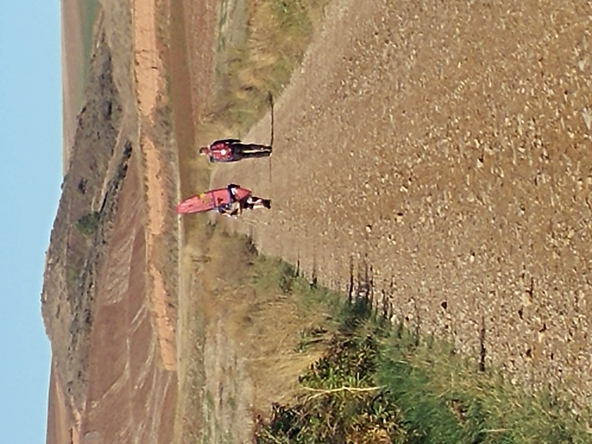

### 09 _13일째\_ 한국에서 온 서퍼 채한나를 소개합니다.

#### Introduce Hanna Chae, a surfer from korea!

길 위에서 13일째, 알베르게에서 쉬고 다음 날 출발하는 생활에 익숙해져 가고 있었다. 
하지만 익숙함과는 별개로 언제나 길은 힘들었다. 
산토 도밍고 데 라 칼사다(Santo Domingo de la Calzada)에서 출발하여 벨로라도(Belorado)까지 가는 
이 날의 일정은 21km 정도의 무난한 거리였다.  

11일째에 폭우를 처음 만났던 나에라에 가는 길에서 켈리와 헤어진 뒤 완전히 혼자 걷게된 지 이틀째였다.
혼자 걷게 된다고 해서 완전히 혼자가 아니다. 
오히려 길을 걷는 다른 사람들과 더 많은 이야기를 하게 되기도 한다.

이 날은 아주 특별한 만남이 있었다.

이제 21km 정도는 사실 그렇게 먼 거리가 아니었는데도 벨로라도까지 가는 이 날이 힘들었던 것은 
추워지기 시작하고 비가 자주 내리는 날씨 때문이었다. 
이맘 때 부터 점점 추워져가는 날씨에 대비하여 버터를 더 많이 먹고는 했는데, 
아무래도 가격 때문에 200g 짜리의 큰 버터를 사는 경우가 많았다. 
그러다보니 가방은 전날 먹고 남은 버터가 항상 더해졌고 이렇게 버리지 못하는 미련은 다음 날 
무게로 허리를 짓눌렀다.

겨우 200g 짜리 버터 한 덩이, 주먹에 잡히는 키위 두 세 알, 300g 정도의 방울토마토 한 봉지가 
추가된 것 뿐이었는데도, 이미 무게가 꽤 나가는 가방에서는 이 마저도 과하게 추가된 무게로 느껴졌다.
언제나 가방이 가볍지 못한 스스로를 보며 어쩌면 이렇게 쉬운 날이 하루도 없을까 생각했다.
그렇게 길을 쭈욱 가던 중간에 사흘 길이면 곧 도착할 대도시 부르고스까지의 이정표가 높게 서 있는 
지점에 도착했다.

그 이정표는 매우 높았다. 그 끝까지 쳐다보니 목적지인 산티아고에 이르기까지 지나갈 곳들을 보여주고 있었다.
너무 높아서 저 끝의 산티아고 글자는 맨눈으로는 잘 보이지도 않을 정도였다. 한 가지 알 수 있는 것은
이 표지판의 높이만큼 아직 갈 길이 멀다는 것이다.

그런데 그 커다란 표지판에 다가기기 한참 전부터 내 앞에는 자기 키 만한 서프보드를 메고 가는 순례자가 있었다.

2018년도 1월 겨울에 인도네시아에 가서 서핑을 배운 적이 있다.
그 때 야심차게 2주 내내 서핑만 제대로 배우겠다고 생각하고 갔으나
실제로 서핑을 배운 날은 단 3일 이었고, 그 마저도 하루에 두 시간 이상 할 수 없었다.
마음만 같아서는 오전에 배우고 오후에 또 혼자 나가서 익힐 수 있을 줄 알았다. 
하지만 직접 해 보니 서핑은 매우 과격하고 체력이 많이 요구되는 스포츠였다. 
3일째 서핑을 하고 나니 내 체력에 더 이상은 교습으로도 혼자서도 파도를 타기에는 무리라는 것을 느꼈던 것이다.

특히 서프보드의 무게는 굉장히 무거운 편이어서 한 손으로 옆구리에 끼고 바다로 나가려면
꽤나 힘들었다.
물론 매우 숙련된 서퍼의 경우 조금 더 작은 규모의 숏 보드를 사용한다고는 했다.
이 순례자가 지고 가던 서프보드는 내가 인도네시아 롬복 섬에서 배울 때 사용했던 입문자용 롱보드 보다는
길이가 짧아 보이기는 했지만 조금 크기가 작다고 해서 절대 가벼울 리는 만무하다.

나는 이 버터 한 덩이와 과일 몇 개 추가 되었다고 허리에 짓눌리는 무게를 느끼는데 저 무거운 서프보드를
도대체 어떻게 지고 가는 것인지 놀라울 따름이었다.
사실 이 서프보드를 지고 걷는 순례자는 전날부터 보였다. 
전날 숙소에서 만났던 사람들과 하루를 이야기 할 때, 다들 서프보드를 멘 사람을 보았느냐는 이야기 했을 정도였으니,
순례길 위에서도 독보적으로 눈에 띄는 사람 일 수 밖에 없었다.
그 사람을 처음 보았던 때는 그 순례자가 내 앞서 가고 있었고 나는 그 사람을 따라 잡을 수도 없었기에 이야기를 나눌 기회가 없었다.
그러다가 이 표지판 앞에서 영상을 찍느라 한참을 서 있는 서프보드를 멘 순례자를 드디어 만나게 된 것이다.

순례길에서 대부분은 짐을 줄이고 싶어하는데 도리어 무거운 서프보드를 지고 걷고 있으니 그 사연이 몹시 궁금 할 만 하지 않겠는가.
왜 이 무거운 서프보드를 메고 길을 걷는지 너무도 궁금하여 인사했다.

> "올라~ 나는 한나라고 해. 어제부터 너를 봤어. 서프보드가 눈에 띄어서"

> "올라, 나는 진저 비커 영국인, 유튜버야."
 
그 사람은 유튜버 명함을 한 장 꺼내 내게 건네주며 인사를 했다. 
으레 순례길에서 만난 사람들이 그렇듯 서로 왜 순례길을 걷는 지 대화를 나누게 되었다.

> "나는 작년에 수술을 했어. 위험한 수술은 아니었지만 7시간이나 걸렸고, 수술후에는 엄청난 고통이 있었어.  
>  그 때는 한 발자국도 걷기 힘들었지. 그 때 생각했어. 그저 걷고 싶다고. 걸을 수 있게 되면 여길 걸어야 겠다고.  
>  그렇게 일년만에 여기에서 걷고 있는 거야"

나는 나의 수술과 수술 후 겪었던 고통 속에서 그저 다시 걷고 싶었다는 이야기를 했다.
내 말을 들은 그는 자신도 수년 전에 건강이 매우 안좋았다고 했다. 
그리고 지금은 병을 이겨냈고 이렇게 서프보드를 메고 걸을 수 있을 정도가 되었다고 했다.
그러며 내게 물었다. 

> "혹시 '나의 산티아고' 라는 영화를 봤어?"

나는 이때까지만 해도 이 영화를 몰랐는데, 
이 서퍼이자 유튜버인 순례자에 따르면 '나의 산티아고' 라는 영화에서도 과로로 쓰러진 주인공이 
수술 후 산티아고 길을 걷는 이야기가 나온다고 했다. 
그리고 이 이야기는 실화이며 책으로도 있고 자기도 아팠을 때, 이 영화를 보며 회복하면 산티아고 길을 걷겠다고 생각했다는 것이다.
또한 지금은 가족의 기도를 이루기 위해 이 길을 걷고 있다고 했다.

이 유튜버 순례자에게 나도 서핑을 배운 적이 있는데, 보드가 너무 무거웠다. 
그런데 어떻게 그 무거운 서프보드를 메고 800km에 달하는 거리를 걸을 수 있느냐고 물었다.

내가 서핑을 배운 적이 있다고 하자 이 유튜버는 갑자기 너무나 반색을 하더니 카메라를 켜서 찍기 시작했다. 
그는 너무나 흥분한 목소리로 나를 소개하며, 산티아고 길에서 만난 최초의 한국인 서퍼라고 하는 것이었다!

> "어메이징 뉴스 입니다! 한나 채는 서퍼에요!" 

> "아니아니, 난 '서퍼'가 아니에요. 그냥 조금 배웠을 뿐이에요~" 

> "왜 이래요~! 어디서 서핑을 배웠나요?"

> "롬복, 인도네시아에서 배웠어요. 셀롱블라냑 해안가였어요."

> "서핑 좋아하나요? ㅎㅎㅎ"
 
> "네~ 서핑 좋아해요, 한국에서 양양 동쪽 해안에서도 서핑을 했어요."
 
> "한국에도 서핑하는 사람들이 많나요?"
 
> "네 한국에도 서핑하는 사람들이 많아요. 남쪽 해안 해운대, 동쪽 해안 양양에서 많이 해요."

> "한국의 바다는 서핑하기에 좋나요?"
 
> "제 생각에는 인도네시아보다 파도가 조금 짧은 것 같아요. 인도네시아 롬복에선 파도가 아주 길었어요." 

> "한국에도 서퍼들을 위한 서프처치(surf-church)가 있나요?"

> "서프처치? 서프학교를 말하는 건가요?"
 
> "아니요, 서프처치 말 그대로 교회를 말하는 거에요."
 
> "한국에는 서프 교회는 없는 것 같아요. 아마도"

내가 서핑을 했었다는 말 한마디에 진저 비커는 너무도 신나하며 인터뷰를 했다.
인터뷰를 하며 서핑에 대해 꽤 길게 이야기를 했는데 한국에도 서핑 인구가 많다는 이야기를 흥미 있어 했다.

그는 계속해서 자기가 서프보드를 메고 걷는 이유에 대해 말해 주었다. 
앞서 이야기 했던 가족의 기도란 서프처치를 세우는 것이라고 했다.
그래서 서프보드를 메고 순례길을 걸으며 매일매일 유튜브를 한다는 것이다. 매일 숙소에 도착하고 나면 편집하여 올린다고 했다.

서프보드는 당연히 매우 무겁고 배낭에 다른 짐까지 포함하면
무게는 10kg은 족히 넘는다고 했다. 
그는 이 순례길에서 서프보드를 메고 처음부터 끝까지 걷는게 자신의 미션(Mission) 이라고 했다.
당시에 나는 이 미션이라는 표현의 의미를 '이루어야 할 목적' 정도로 받아들였는데,
지금 생각해보면 그는 정말로 선교 혹은 사명이라는 의미로 사용했던 것이 아닌가 싶다.
서핑으로 선교하는 서프교회를 전 세계에 세우는 것이 가족의 기도라고 했고 그것을 이루기 위해 이렇게 서프보드를 메고 걷는다고 했으니
그 사람은 정말로 선교를 위해 하고 있었던 것이 아니었을까.

그는 서프보드를 메고 산티아고에 도착한 뒤, 더 서쪽 끝으로 갈 것이라고 했다. (아마 피스테라를 이야기 했던 것 같다.)
그 서쪽 끝의 바다에서 서핑을 할 예정이라고 했다.
그는 아까 건네준 명함의 유튜브 채널로 들어가보라고 하며 오늘의 인터뷰도 편집해서 올라갈 것이라며 반가웠다고 이야기 했다.
그를 만났던 산티아고길 표지판에서 부터 한 4km 정도를 이야기 하면서 함께 걸은 뒤 그가 앞서 나가며 헤어졌다.
그는 서프보드를 메었음에도 나보다 더 걸음이 빨랐다. 그 날 이후로 진저 비커를 다시 만나지는 못했다.

순례길을 다 걸은 뒤 순례길에서 사귄 일본인 나리타 요시요키씨의 안부 메일에서
그 서프보드를 멘 순례자와의 소식을 들을 수 있었다. 
요시요키씨는 나와 헤어진 후 그를 만났고 그 사람의 명함을 받아 유튜브 채널을 들어가보았는데,
거기서 나의 인터뷰를 보았다는 소식을 전해왔다.

모두가 짐을 가볍게 지니기 원하는 순례길. 
프랑스로 떠나던 비행기에서 만났던 노부부의 아들은 자기가 가장 가방이 가벼운 사람이 될 거라고 하며 최소한의 짐만을 챙겼다고 했다.
어떤 순례길 유튜브 콘텐츠를 보면 아얘 배낭을 지지 않고 에코백 하나만 들고 
이 길을 걸은 사람의 이야기도 있다.

대개 길을 걷는 자체만으로 워낙 힘들기 때문에 대부분은 짐을 가볍게 하는데 신경 쓴다.
나도 더 가볍고 싶었고, 내가 만났던 미국인 심리학자, 미국인 퇴직 교사도 가볍게 가져오지 못한 
자신을 다시 돌아보고는 했다. 하지만 오히려 무거운 서프보드를 메고 걷던 이 순례자를 보면 
자신이 지고 걷는 무게란 무엇인지 다시 생각해보게 된다.

내 짐의 무게가 무겁다고 해서 내가 미숙하거나 요령이 없거나 잘못하고 있는 것이 전혀 아닌
그저 그것이 내가 지고 갈 무게라는 담백한 단 하나의 사실만 알게 되는 것이다.